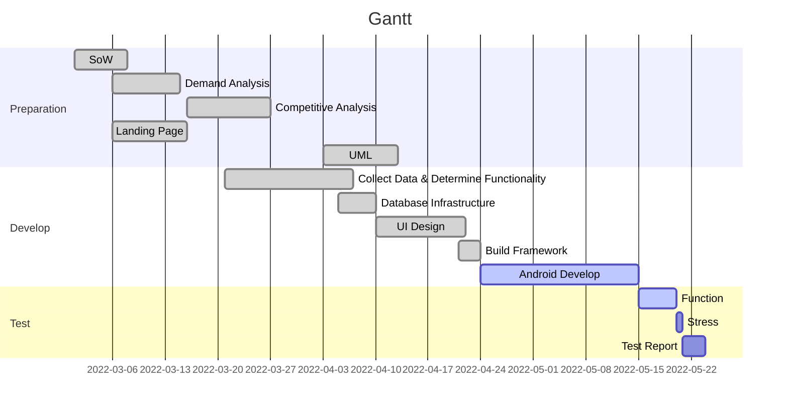

# Inner Intel

### 01_Project Landing Page:

 [Link to Landing Page](https://personalisednutrition.github.io/)

### 02_Project Description:

> With the improvement of living standards in recent years, people have started to pay more attention to a healthy diet rather than blindly consuming foods with no nutrition. Personalized nutrition is an excellent way to help people know more about their bodies. Professional guidance is also essential to help people gain a healthy diet and lifestyle. However, most of the diet or health apps on the market are very general and have no way to analyze the personal body conditions of individuals. These apps also do not offer users personalized suggestions from professional nutritionists generally.

Team S.A.Y. plans for this situation with the project “Inner Intel”. Inner Intel mainly provides three functions: 

- Record the diet, physical symptoms, mood, excretion, and other information by selecting, typing, or taking photos. 

- Analyze the recorded data and generate mini-reports by the Machine Learning(ML) algorithm.

- Provide a platform for users to get personalized suggestions from nutritionists via communication.

Inner Intel provides a user-friendly interface. We have developed the manual input function, and later we will add image recognition techniques to help users input more efficiently. In order to have a comprehensive analysis, we also design the functions for recording physical symptoms, excrement, moods, and others. Basic functions include login, registration, and personal profile are intended to ensure each user can have a private account to record their logs and receive targeted suggestions. A platform to communicate with nutritionists is also one of the features of our products. This ensures that users can get personalized advice.

Inner Intel mainly serves two groups of users:

- One group is general users, who log their daily diaries to get better dietary advice from nutritionists.
- The other is nutritionists who can generate a summarized report about correlations based on users’ logs by ML algorithms.

### 03_Project Process:

| Project Process         | [Google Drive](https://drive.google.com/drive/folders/1Pg12I2ME4Pvlo-iDjD7b0m8Rw_jzdHFB?usp=sharing) |
| ----------------------- | ------------------------------------------------------------ |
| 01_Project Maps         | [[Link]](https://drive.google.com/drive/folders/1e5v3iCPpizGk3pQbZGY10LXfbwIhGn_-?usp=sharing) |
| 02_User story           | [[Link]](https://drive.google.com/drive/folders/1U9VsxM0uiw5tEAwA3rhvaKu3sakZfXTE?usp=sharing) |
| 03_Competitive Analysis | [[Link]](https://drive.google.com/drive/folders/1P6339gmpGCgMWNqUWAeUrbRAnXYu6GUj?usp=sharing) |
| 04_Design Pattern       | [[Link]](https://drive.google.com/drive/folders/1Lg-yWEl3GUdO-UUAdmnF7PNVqUotjODK?usp=sharing) |
| 05_Product Design       | [[Link]](https://drive.google.com/drive/folders/1-6Rk-p2_8sqL5Qeykyn4-FbKiJfwuarI?usp=sharing) |
| 06_UI Design            | [[Link]](https://drive.google.com/drive/folders/1MLHTPZV8Xxn70SBEbRCPPjSDnWAVVO96?usp=sharing) |

### 04_Gantt Chart：

### 05_Group S.A.Y. Team Members:

| Name        | Title                      | Email               |
| ----------- | -------------------------- | ------------------- |
| Yuhao Zhai  | Spokesperson               | u7152566@anu.edu.au |
| Shuyi Chen  | Spokesperson               | u7175274@anu.edu.au |
| Tianqi Tang | Techinical Lead            | u7192230@anu.edu.au |
| Shiyun Zhu  | ALGO Manager               | u7041419@anu.edu.au |
| Xinyue Hu   | UI Manager                 | u7151386@anu.edu.au |

### 06_Communication Plan:

|       Stakeholder       | **Method**   | **Frequency**                                                |
| :---------------------: | ------------ | ------------------------------------------------------------ |
|         Client          | Email & Zoom | Organize zoom meeting after finishing each sprint & frequently Email exchanges |
|          Tutor          | Email & Zoom | Weekly tutorial Thursday 1pm-3pm  & as required              |
|       Shadow Team       | Wechat       | Weekly Tutorial & as required                                |
|          Team           | Wechat       | Weekly on Monday from 10pm to 12am & as required             |
| Nutritionist From Xyris | Email & Zoom | Thursday of the fourth week of every month from 3pm to 4pm & as required |

